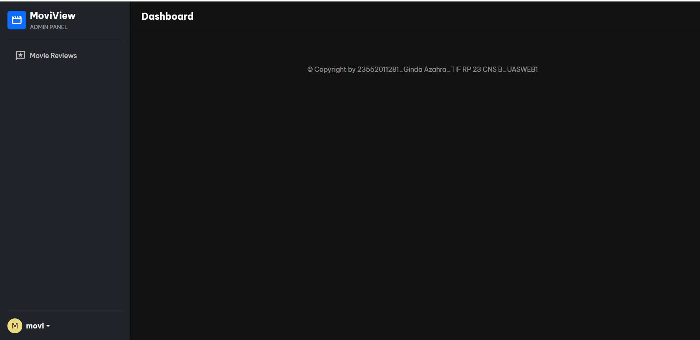
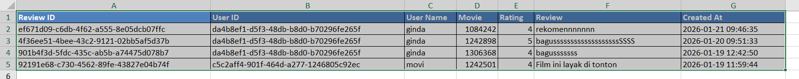
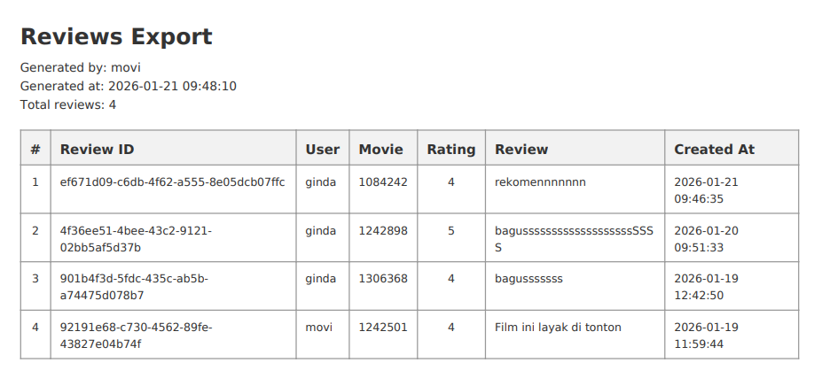

# 🎬 MoviView

**MoviView** adalah aplikasi berbasis web untuk **mencari, melihat detail, dan memberikan review film** menggunakan data dari **The Movie Database (TMDB)**.

Aplikasi ini memungkinkan pengguna untuk:
- Mencari film berdasarkan judul
- Melihat detail film
- Memberikan rating dan review
- Melihat daftar film yang sudah direview
- Export data review ke **PDF** dan **Excel**

---

## 🧩 Repository

### 🔹 Frontend
React 
👉 https://github.com/GindaAzahra/MoviView-Frontend

### 🔹 Backend
Laravel REST API  
👉 https://github.com/GindaAzahra/MoviView-Backend

---

## 🛠️ Tech Stack
- Frontend: **React, Vite**
- Backend: **Laravel**
- External API: **TMDB API**

---

## 🎯 Purpose
MoviView dibuat sebagai aplikasi **movie review** yang sederhana, terstruktur, dan mudah dikembangkan, dengan arsitektur frontend–backend terpisah.

---

## 📸 Screenshots

### 🏠 Halaman Beranda

### 🔐 Halaman Login & Registrasi

### ⭐ Review

### 🛠️ Halaman Admin

### 📄 Export Laporan (PDF & Excel)

